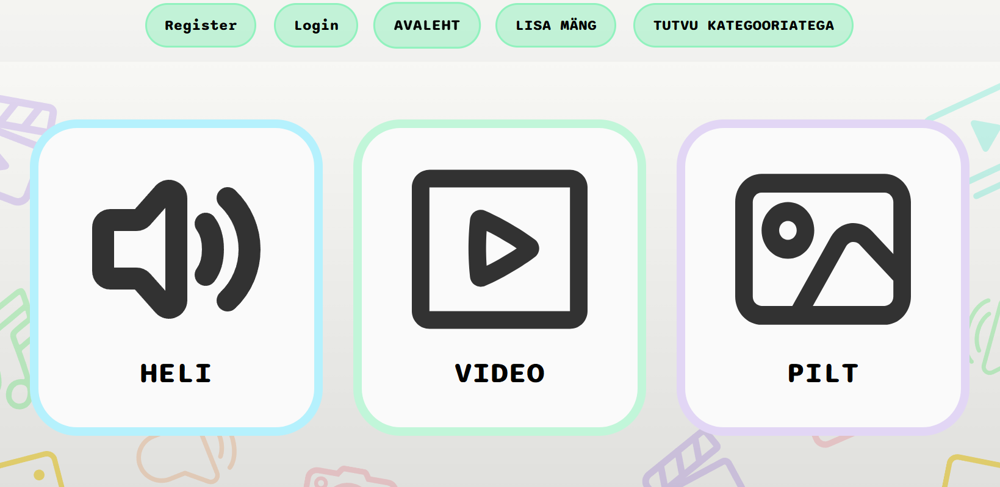
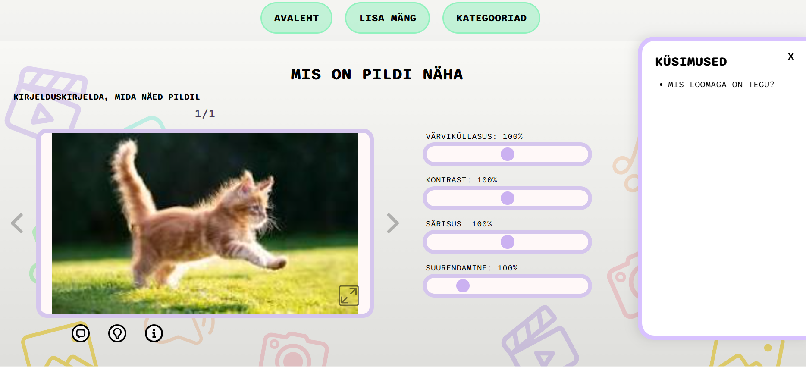

# Minikino veebileht

| Avaleht  									| 	Kategooriad 							| Mäng 									   |
| ----------------------------------------- | ----------------------------------------- | ------------- 						   |
|   |   |  |

## Eesmärk

Minikino eesmärk on anda õpetajatele valmis ning lihtsasti kohandatav õppekeskkond, mille alusel saab õpetada lastele meediaelementide olemust ning, kuidas nende mõjutamisel muutub edastatav sõnum. Õppekeskkonna fookuses on kasutajasõbralik disain, mis on kasutatav ka õpetajatele ja huvijuhtidele, kellel on vähesem digipädevus. Mänge saab kasutada nii erinevate õppeainete teemade raames kui ka vahetunni tegevusena, mis on lastele huvitav ja õpetlik.

Minikino veebileht on loodud Tallinna Ülikooli informaatika üliõpilaste poolt esimesel kursusel tarkvaraarenduse praktika raames koostöös meediaharidus OÜ-ga.

○ kasutatud tehnoloogiad ja nende versioonid(!);
## Kasutatud Tehnoloogiad
VsCode - Ver. 1.124.2

IntelliJ IDEA ULTIMATE - Ver. 25.0.2+1-b329.117

pgAdmin - Ver. 9.15

ZONE - Ver.????

## Autorid
Veebilehe koostajad on Martin Saareväli, Roland Piperal, Õnne Elisabeth Maripu, Anette Aruorg ja Carolina Treu. Projekti loomine andis meile kogemusi ka edaspidi suuremate projektidega tegelemiseks. 

## Paigaldamine
Frontend:

Tuleb rakenduse failid alla laadida, ning frontendi on võimalik jooksutada VsCodeis. Vaja on alla laadia Node, React ja Vite. 

Nende allalaadimiseks on vaja terminalis jooksutada "npm install" mis automaatselt laeb alla kõik vajalikud "package"-id

○ selgeid paigaldusjuhiseid ja arenduskeskkonna ülesseadmise juhised, et kes iganes saaks selle
		vajadusel käima (näiteks andmebaasi tabelid jm info peaks olema teksti kujul, et saaks kopeerida, aga
		loomulikult ei saa suure andmebaasi loomise skript tervikuna README-failis olla), juhendi abil saab
		"toote" peale koodi allalaadimist sobilikus kohas käima panna;
		
## Litsents		

kasutatav litsents on creative commons.
